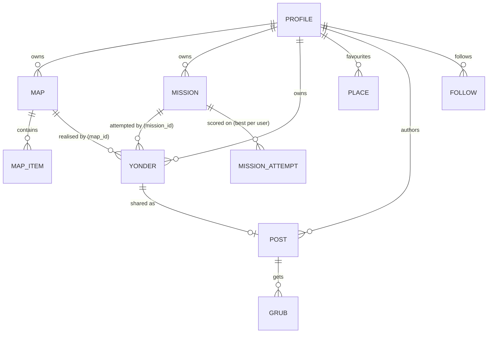

# SCHEMA.md — the object model (source of truth)

The data model for Yonderful. **CLAUDE.md is the brand law; this is the data law.** Read both before touching the schema, the data layer (`lib/data/*`), or anything social. If code and this doc disagree, this doc wins — fix the code (or, if the model genuinely needs to change, change this doc *first*, deliberately).

---

## The spine

**Yonderful is Strava for exploring, and it has Strava's spine: the *activity* is the centre of gravity, and nothing is ever detached from it.** Everything you do produces a **yonder**. Plans are things you load to do; the leaderboard is a projection of yonders; a share is a yonder made public. If you ever find an object that floats free of a yonder, the model is broken.

The Strava mapping, almost one-to-one:

| Strava | Yonderful | Table |
|---|---|---|
| **Activity** (a recorded outing) | **Yonder** | `yonders` |
| **Route** (a saved plan you load) | **Map** | `maps` + `map_items` |
| **Segment** (a stretch with a board) | **Mission** | `missions` |
| **Segment effort** (your scored run) | **Mission attempt** | `mission_attempts` |
| **Kudos** on an activity | **Grub** on a post | `grubs` |

We diverge from Strava in exactly **two** places, both on brand (see CLAUDE.md):
1. **Sharing is opt-in, never automatic.** Strava auto-posts every activity. We don't. Finishing a yonder shares *nothing* until you tap Share. (The one exception is a mission's *board entry* — see below.)
2. **A mission is a deliberate mode, not passive detection.** Strava auto-detects segment efforts inside any ride. We can't: *trying to hold the line is the whole point*, so a mission attempt only counts when you chose to attempt it.

---

## The nouns (closed definitions)

| Noun | Layer | What it is |
|---|---|---|
| **Place** | value | A named point (lat/lon). Not a hub: it lives *inline* as a map item, a yonder destination, a mission's A/B. Only a **saved favourite** gets its own row (`places`). Don't over-normalise points. |
| **Map** | **plan** | A reusable set of places. No trace. Walkable repeatedly, shareable. `maps` + `map_items`. |
| **Mission** | **plan** | A reusable straight-line challenge: a line A→B + medal bands. Has a public leaderboard. `missions`. |
| **Yonder** | **activity** | One outing you walked. Always has a trace, time, stats, Yondered. **Optionally realises one plan** — `map_id` *or* `mission_id`, never both — else it's a free/single wander. A mission-yonder also carries `play='straightline'` + its straight-line result. **Private** (owner-only). `yonders`. |
| **Mission attempt** | projection | Your **best score** on a mission's board. A *public, coordinate-stripped* projection of your mission-yonders. Exists because yonders are private but the board must be public. `mission_attempts`. |
| **Post** | share | A yonder you chose to **show**. The feed citizen. `posts`. |
| **Grub** | social | One-tap kudos on a **post**. `grubs`. |

### Map and Mission are siblings: both are *plans*
They differ in shape (a set of places vs a line) and in what doing them produces (a wander vs a scored line), so they're two tables. But conceptually they're the same layer: *a thing you load and do, repeatedly, and can make public.*

---

## The relationships

### The one rule that decides everything
> **A plan → you walk it → it produces a yonder linked to that plan → you may post the yonder (share the activity). The plan itself goes public via a `visibility` flag, browsed in its Community tab — *not* as a feed post.**

Read that twice. It has three consequences that the code MUST honour:

1. **A mission attempt is just a yonder that realises a mission** — exactly symmetric to a map-yonder realising a map. So a completed mission **shows in your profile/history like any yonder**, and is **re-attemptable** (its `mission_id` persists). *(This is the fix for "the mission's in the feed but not my profile" and "missions aren't hooked in.")*
2. **Posts are activities only.** `posts` carries `kind='yonder'` (a shared yonder) and `kind='ways'` (a ways report = a snapshot aggregate of many of your own yonders). **There are no `kind='map'` / `kind='mission'` posts.** Plans don't go in the feed.
3. **Plans are public via `visibility`, browsed in their tab.** A public map appears in **Community → Maps**; a public mission in **Community → Missions** (read live by visibility). The feed (**Community → Following / Everyone**) is yonders + ways only. This is Strava: the feed is activities; routes and segments live in libraries.

---

## The tables

Every public table is **RLS-enabled**, rows tied to `auth.uid()`. Guest data lives in `localStorage` and is imported on sign-up (`lib/data/import.ts`).

**Identity & prefs** — `profiles` (1:1 user; `username`, `is_admin`), `settings` (`hide_numbers`), `entitlements` (Yonder+ status).

**Plans** — `maps` (`name`, `area`, `visibility`), `map_items` (a place in a map; `visited`/`visited_at` are owner-only and never exposed on public reads), `missions` (`name`, A/B coords, `distance`, medal band columns `platinum_m`/`gold_m`/`silver_m`/`bronze_m`, `visibility`).

**Activity** — `yonders` (`track` jsonb owner-only, `mode`, `destinations`, `paused_ms`, `caption`, **`map_id`**, **`mission_id`**, **`play`**, **`straight_line`** jsonb). The straight-line result on a mission-yonder is the *source* of that outing's score; the board row is derived from it.

**Board** — `mission_attempts` (unique per `(mission_id, user_id)` = your best; carries the score + normalised path for the overlay, **no real coords** — privacy-safe and public-readable).

**Sharing & social** — `posts` (`kind` ∈ {`yonder`,`ways`}, `ref_id`, `caption`, `visibility`, `area`, `payload`), `grubs` (kudos, keyed on `post_id`), `follows`, `notifications`, `reports`, `blocks`.

**Saves** — `places` (favourite places), `map_takes` (a public map you've taken), `mission_saves` (a mission you've saved to attempt). *(`saved` is the legacy bookmark table — deprecated.)*

**Monetization (built, currently ungated)** — `usage_counters` (metered allowances per period), `feature_gates` + `meter_limits` (DB-backed live gating config, edited from the admin panel). See PAYMENTS.md. Defaults are all-free; nothing is gated.

### Posts: snapshot, never reference
A `kind='yonder'` post **snapshots** an obfuscated memento into `payload` (home zone removed, coords stripped to a 0–100 memento). It never live-dereferences the private yonder. `kind='ways'` likewise snapshots an aggregate. Because posts only ever wrap *private* sources, the rule is simple: **a post always carries its own obfuscated payload.** (Plans are public-readable and read live in their tabs, so they were never posts — that asymmetry is gone.)

### Privacy invariants (non-negotiable)
- The precise `yonders.track` is **owner-only**. There is no public/followers read path on `yonders`.
- You share **a memento, never a route.** Sharing publishes an obfuscated *copy* into `posts.payload`.
- `mission_attempts` is public but **coordinate-free** (normalised path only).
- **Never** call `/api/place-photo` on shared content — its coords are stripped on purpose. Photos are only for surfaces where real coordinates are owned (recap, maps, search).

---

## Alignment status

The model above is the **target**, and the core refactor is **done** (migrations 0024 + 0025 applied):

1. ✅ **`yonders` carries `mission_id` + `play` + `straight_line`** (0024). A mission attempt is now a real, linked, profile-visible, repeatable yonder — written + read by `lib/data/yonders.ts`.
2. ✅ **One sharing path.** `shared_yonders` is retired (no longer written); `publishYonder`/`shareStatus`, the feed, and the **profile** all read `posts`. *(Fixes "shows in the feed but not the profile.")* The only lingering read is a harmless legacy-id fallback in `getSharedYonder`.
3. ✅ **Grubs allow `subject_type='post'`** (0025); the feed/profile/detail key grubs on `post.id`.

**Still deferred (not blocking):**
- **Map/mission *plan* posts** (`kind='map'`) still exist (`setMapPost`); SCHEMA's end-state is plans surface in Community → Maps/Missions by `visibility`, not as feed posts. Public maps are *already* read live from the `maps` table in `loadCommunity`, so the map-post is redundant — safe to drop later. Posts should end up yonder + ways only.
- `origin` (a mission line's A point) isn't a cloud column; a re-run uses the mission's A/B (or your current spot). Fine for now.

---

## Rules for whoever edits this (human or AI)

- **Every outing produces a yonder.** A mission attempt is a yonder with `mission_id` set. Never persist a mission attempt as anything but a yonder (+ its derived board row).
- **Don't reintroduce `shared_yonders`** or any second sharing path. One feed citizen: `posts`.
- **Don't post plans.** No `kind='map'`/`kind='mission'`. Plans go public via `visibility` and live in their tabs.
- **A yonder realises at most one plan** — `map_id` XOR `mission_id`.
- **The board is a projection.** Don't try to read other users' yonders to build a leaderboard (RLS forbids it, by design); read `mission_attempts`.
- Keep the privacy invariants above. Sharing is opt-in. The board entry is the *only* thing a mission finish publishes automatically — and it's coordinate-free.
- Migrations: write the file under `supabase/migrations/`, then ask Tom to apply (the agent can't apply live DB migrations). Apply locally with `supabase db reset` for testing.
